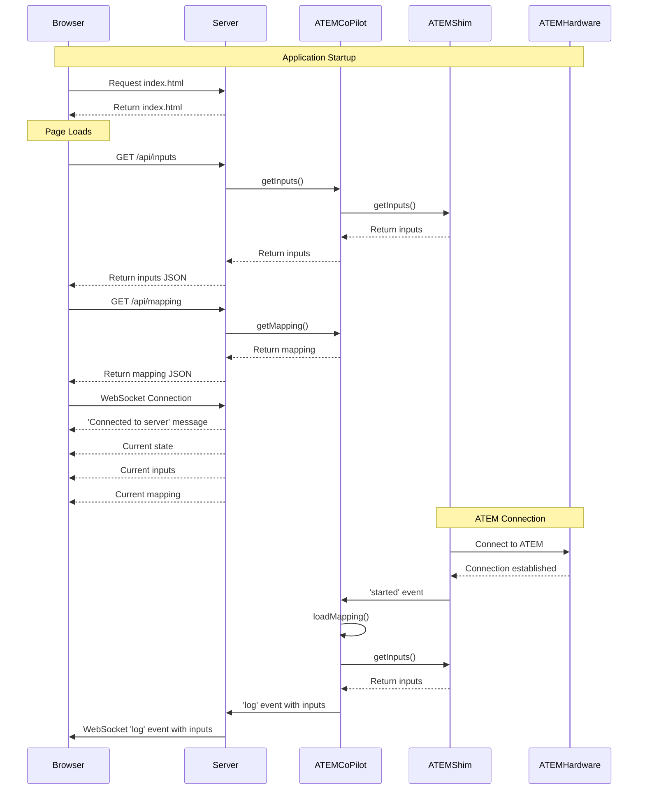
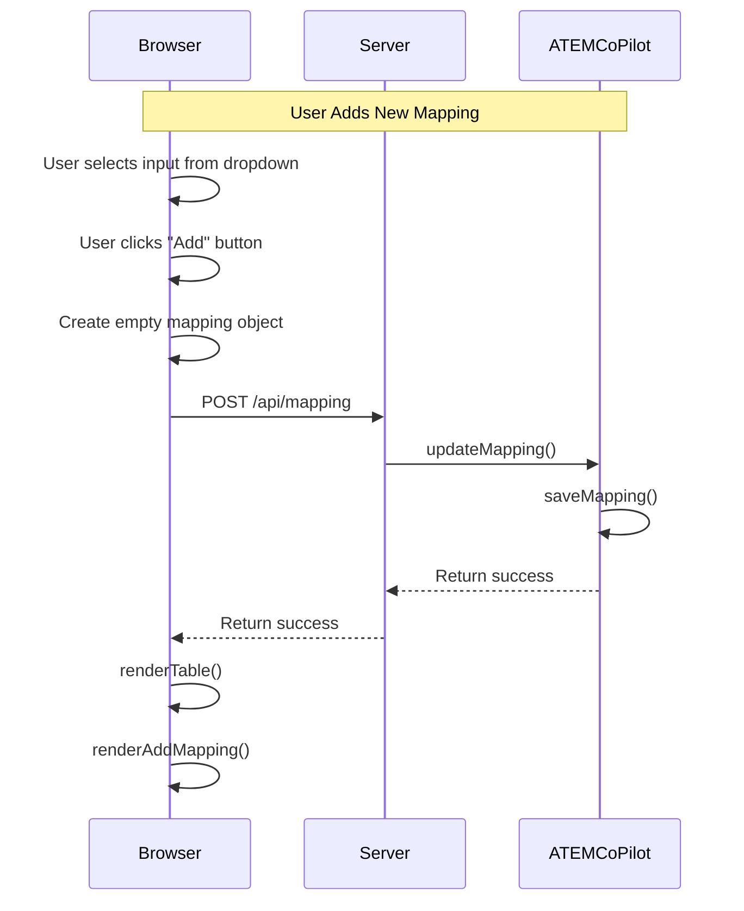
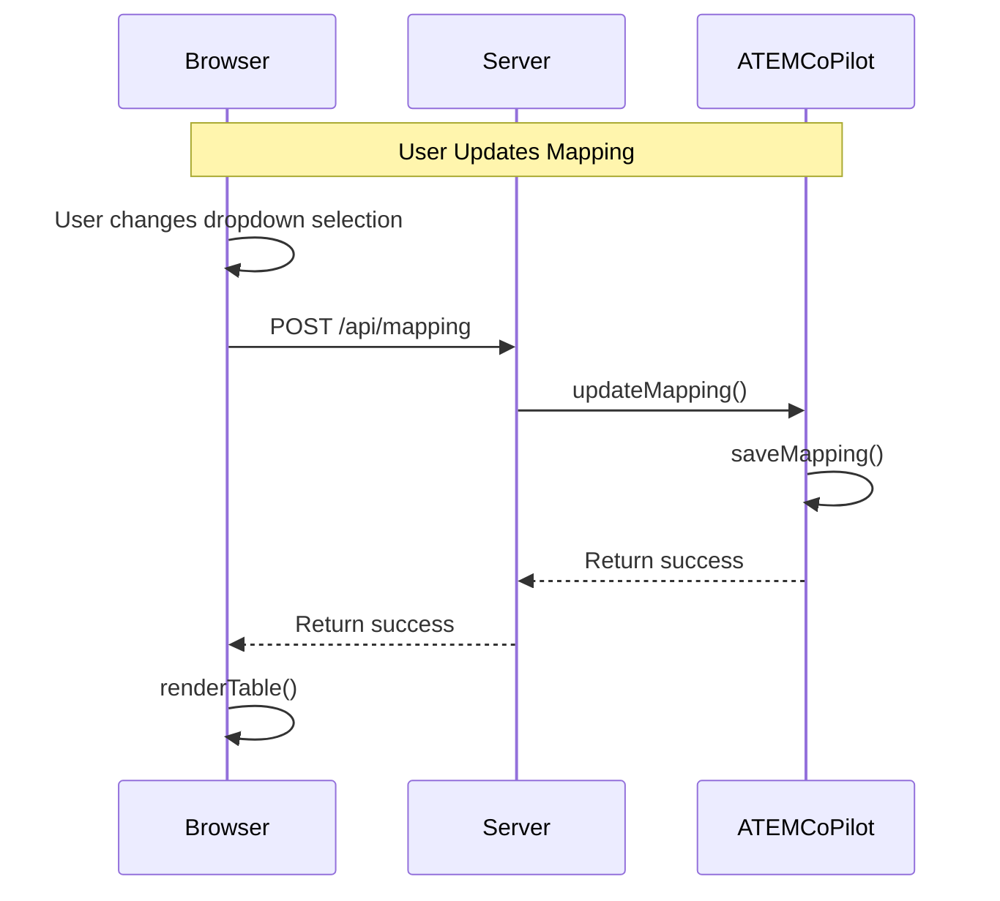
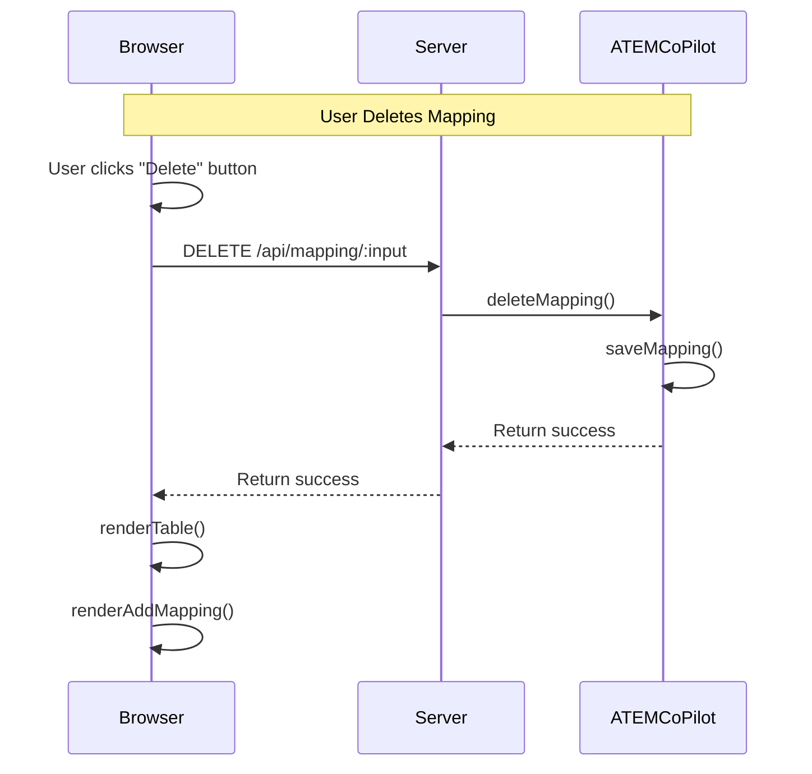
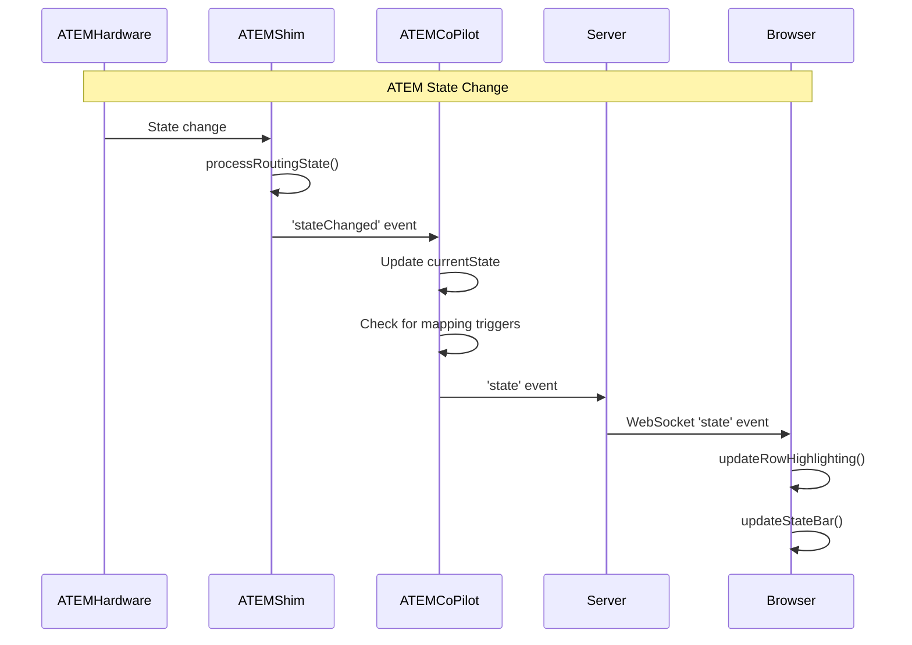
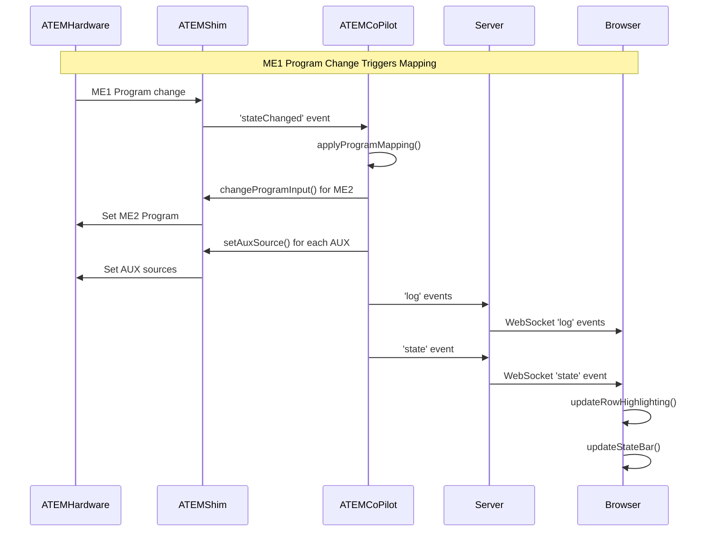
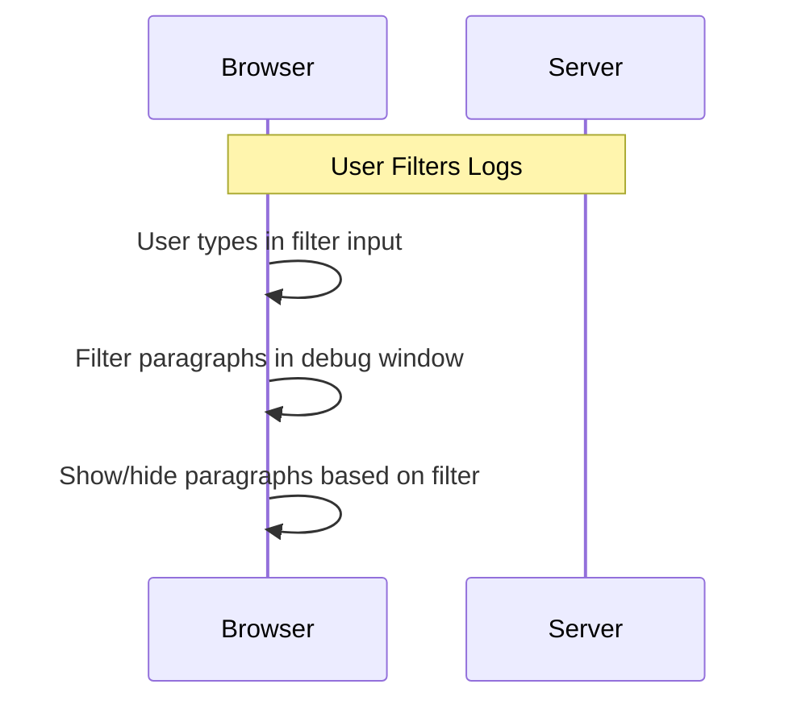

# ATEM Co-Pilot Application Lifecycle

## Overview

This document outlines the lifecycle of the ATEM Co-Pilot application, explaining the interactions between the server components and the web interface. The application allows users to map ATEM switcher inputs to various outputs (ME2, AUX1-4) and provides real-time state monitoring.

## System Components

- **Web Interface (index.html)**: The user-facing interface for mapping and monitoring
- **Server (copilot_server.js)**: Express server that handles API requests and WebSocket connections
- **ATEM Co-Pilot (atemCopilot.js)**: Core logic for managing mappings and ATEM interactions
- **ATEM Shim (atem-shim.js)**: Low-level interface to the ATEM switcher hardware

## Initialization Flow

## User Interaction Flows

### Adding a New Mapping

### Updating a Mapping

### Deleting a Mapping

## Real-time State Updates

## Mapping Trigger Flow

## Log Filtering

## Detailed Component Interactions

### Server (copilot_server.js)

The server component:
- Serves static files (index.html, CSS, JS)
- Provides REST API endpoints for inputs, mapping, and state
- Handles WebSocket connections for real-time updates
- Forwards events from the ATEM Co-Pilot to connected clients

### ATEM Co-Pilot (atemCopilot.js)

The ATEM Co-Pilot component:
- Manages the mapping between inputs and outputs
- Loads and saves mapping configuration
- Applies mappings when ATEM state changes
- Forwards events from the ATEM Shim to the server

### ATEM Shim (atem-shim.js)

The ATEM Shim component:
- Connects to the ATEM hardware
- Provides a clean interface for controlling the ATEM
- Processes state changes from the ATEM
- Converts ATEM paths to human-readable format

### Web Interface (index.html)

The web interface:
- Displays the current mapping configuration
- Allows users to add, update, and delete mappings
- Shows real-time state of the ATEM
- Provides a debug window with filtered logs

## State Management

The application maintains several key state objects:

1. **ATEM State**: Current state of the ATEM switcher (ME1, ME2, AUX1-4)
2. **Mapping Data**: Configuration of how inputs map to outputs
3. **Input Data**: List of available inputs from the ATEM
4. **Previous AUX Values**: Used to detect changes for visual feedback

## Event Flow

Events flow through the system as follows:

1. **Hardware Events**: Changes in the ATEM hardware trigger events in the ATEM Shim
2. **State Events**: ATEM Shim processes state changes and emits them to ATEM Co-Pilot
3. **Mapping Events**: ATEM Co-Pilot applies mappings and emits events to the server
4. **Server Events**: Server forwards events to connected clients via WebSocket
5. **UI Events**: Browser updates the UI based on received events

## Conclusion

The ATEM Co-Pilot application uses a combination of REST APIs and WebSockets to provide real-time interaction with an ATEM switcher. The modular architecture allows for clean separation of concerns between the hardware interface, business logic, and user interface components. 